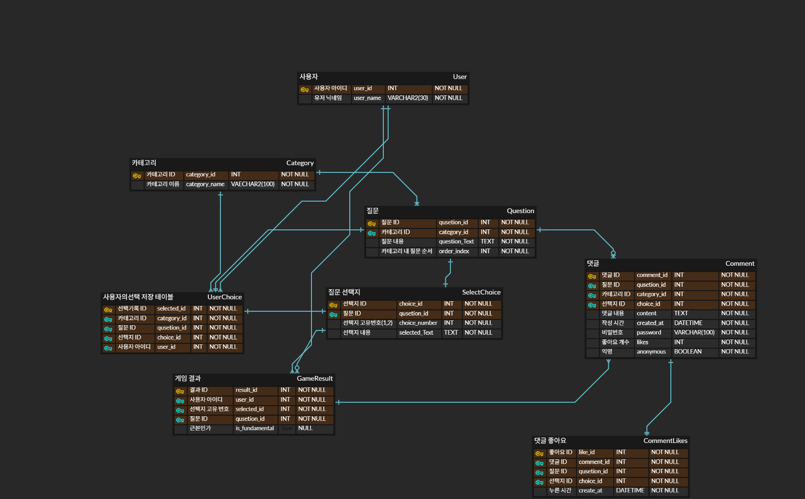

# ⚖️ Balance Game Backend (밸런스 게임)

**ECC 2024 Winter Team 2** 프로젝트의 백엔드 리포지토리입니다.
사용자가 다양한 카테고리의 밸런스 게임(양자택일) 질문에 투표하고, 결과를 실시간으로 확인하며 익명 댓글로 소통할 수 있는 웹 서비스입니다.


## 📝 프로젝트 소개

이 프로젝트는 **"나는 근본 인간일까?"** 라는 질문에서 시작된 밸런스 게임 서비스입니다.

  * **게임 플레이**: 연애, 음식, 병맛, 인생 등 다양한 카테고리의 질문에 투표합니다.
  * **결과 분석**: 나의 선택이 대중적인 선택('근본')과 얼마나 일치하는지 백분율로 분석해 줍니다.
  * **커뮤니티**: 각 질문에 대해 익명으로 댓글을 달고 좋아요를 누르며 소통할 수 있습니다.

## 🛠 Tech Stack

| 분류 | 기술 |
| --- | --- |
| **Language** | Java 17 |
| **Framework** | Spring Boot 3.4.2 |
| **Build Tool** | Gradle |
| **Database** | MySQL |
| **ORM** | JPA (Hibernate) |
| **Server** | AWS EC2 (Deployment) |

## 📂 프로젝트 구조 (Project Structure)

```
src/main/java/com/ecc/balancegame
├── config          # WebConfig (CORS 설정 등)
├── controller      # API 컨트롤러 (요청/응답 처리)
├── domain          # Entity 클래스 (DB 테이블 매핑)
├── dto             # DTO (Data Transfer Object)
├── exception       # 전역 예외 처리 핸들러
├── repository      # JPA Repository (DB 접근)
└── service         # 비즈니스 로직 구현
```

## 🗂️ Database Schema (ERD)

프로젝트의 데이터베이스 구조는 아래와 같습니다.


## ✨ 주요 기능

1.  **유저 관리**
      * 닉네임 중복 확인 및 유저 생성 (LocalStorage 연동)
2.  **게임 플레이**
      * 카테고리별 질문 및 선택지 조회
      * 사용자 투표 결과 저장 (10개 질문 일괄 전송 처리)
3.  **통계 및 분석**
      * **근본 테스트**: 다수결 선택지와 내 선택의 일치도를 계산하여 '상위 n%' 결과 제공
      * **실시간 통계**: 질문별/카테고리별 선택 비율(%) 시각화 데이터 제공
4.  **댓글 시스템**
      * 질문별 익명 댓글 작성 (비밀번호 설정)
      * 댓글 수정/삭제 (비밀번호 검증)
      * 댓글 좋아요(중복 방지) 및 취소

## 📡 API 명세 (API Endpoints)

### 👤 User (유저)

| Method | URI | Description |
| :--- | :--- | :--- |
| `POST` | `/api/user/username` | 닉네임 등록 및 유저 생성 |

### 📂 Category & Question (카테고리 및 질문)

| Method | URI | Description |
| :--- | :--- | :--- |
| `GET` | `/api/categories` | 전체 카테고리 목록 조회 |
| `GET` | `/api/categories/{categoryId}/questions` | 특정 카테고리의 질문 및 선택지 목록 조회 |

### ✅ Choice (투표)

| Method | URI | Description |
| :--- | :--- | :--- |
| `POST` | `/api/choices` | 사용자의 게임 선택 결과 저장 |

### 📊 Game Result (결과)

| Method | URI | Description |
| :--- | :--- | :--- |
| `GET` | `/api/game/{userId}` | 사용자의 '근본' 일치도 결과 조회 |
| `GET` | `/api/game/result/{categoryId}` | 특정 카테고리의 질문별 선택 비율 조회 |
| `GET` | `/api/game/results` | 전체 질문에 대한 통계 결과 조회 |
| `GET` | `/api/game/result` | 카테고리 이름(`categoryName`)으로 통계 조회 |

### 💬 Comment (댓글)

| Method | URI | Description |
| :--- | :--- | :--- |
| `GET` | `/api/comments` | 댓글 목록 조회 (`categoryId`, `questionId` 필요) |
| `POST` | `/api/comments` | 댓글 작성 (비밀번호 포함) |
| `PATCH` | `/api/comments/{commentId}` | 댓글 수정 (비밀번호 검증) |
| `DELETE` | `/api/comments/{commentId}` | 댓글 삭제 (비밀번호 검증) |
| `POST` | `/api/comments/{commentId}/like` | 댓글 좋아요 |
| `DELETE` | `/api/comments/{commentId}/like` | 댓글 좋아요 취소 |

## 🚀 설치 및 실행 방법 (Getting Started)

### 1\. Prerequisites

  * **Java 17** 이상
  * **MySQL** Database

### 2\. Repository Clone

```bash
git clone https://github.com/ecc-2024-winter-team2/balancegame_be.git
cd balancegame_be
```

### 3\. 환경 변수 설정 (Environment Variables)

`src/main/resources/application.properties` 파일의 설정을 본인의 DB 환경에 맞게 수정하거나, 실행 시 환경 변수로 주입해야 합니다.

  * `DB_URL`: `jdbc:mysql://localhost:3306/balancegame` (예시)
  * `DB_USERNAME`: DB 사용자명
  * `DB_PASSWORD`: DB 비밀번호

### 4\. Build & Run

**Mac/Linux:**

```bash
./gradlew clean build
./gradlew bootRun
```

**Windows:**

```cmd
gradlew.bat clean build
gradlew.bat bootRun
```

서버가 실행되면 `http://localhost:8080` 에서 API를 호출할 수 있습니다.
